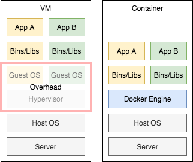

### Docker

* 컨테이너 기반의 오픈소스 가상화 플랫폼

* 컨테이너

  * 격리된 공간에서 프로세스가 동작하는 기술

  * 기존의 VM 방식과의 차이점

    

    * 기존 VM에서의 가상화는 OS를 가상화 하였다. => 성능 문제
    * 이를 개선하기 위해 프로세스 격리하는 방식이 등장
      * 성능 손실이 거의 없음
      * 대신, 네트워크 성능이 중요한 프로그램인 경우 --net=host 옵션을 고려해야 한다.

* 이미지

  * 컨테이너 실행에 필요한 파일과 설정값 등을 포함하고 있는 것
  * 상태값을 가지지 않고, 변하지 않음(Immutable)
  * 컨테이너는 이미지를 실행한 상태이고, 추가되고 변하는 값은 컨테이너에 저장됨
  * 같은 이미지에서 여러 개의 컨테이너를 생성할 수 있고
  * 컨테이너의 상태가 바뀌거나 컨테이너가 삭제되더라고 이미지는 변하지 않고 그대로 남아 있음
  * 도커 이미지는 Docker hub에 등록하거나 Docker Registry 저장소를 직접 만들어 관리할 수 있음

### Docker Architecture

* Docker Daemon(dockerd)
  * Docker API요청을 받고 Docker Object(image, container, network, volumn 등)를 관리
  * Docker Service를 관리하기 위해 다른 데몬과 커뮤니케이션 
* Docker Client
  * 사용자가 docker의 접점
* Docker Engine
  * Docker Client/Server(Docker Daemon) 어플리케이션을 통틀어 Docker Engine이라고 함
* Docker Registry
  * Docker Image 저장
  * Docker Hub는 public 레지스트리
  * private 레지스트리도 만들 수 있음
* Docker Object
  * Images
    * 필요한 프로그램, 라이브러리, 소스 등을 설치한 뒤어 파일로 만든 것
  * Containers
    * 이미지가 실행된 상태
    * 이미지를 여러번 실행시키면 하나의 여러 개의 컨테이너가 만들어 진다. 
    * 운영제체로 본다면 이미지는 일종의 실행파일, 컨테이너는 프로세스와 유사한 개념
  * Networks
  * Volumes
  * Plugins

### 도커를 구성하는 컴포넌트

* Docker Compose
  * 여러 컨테이너를 관리하기 위한 툴
  * 여러 개의 컨테이너 구성 정보를 코드로 정의하고 명령을 실행함으로써 애플리케이션의 실행 환경을 구성하는 컨테이너들을 관리하기 위한 툴
* Docker Swarm
  * 여러 도커 호스트를 마스터와 노드 구조로 클러스터화 하는 툴(쿠버네티스와 비슷한 기능)
* Docker Machine
  * 로컬의 VirtualBox나 퍼블릭 클라우드에 도커 실행 환경을 구축하는 툴
* Docker Registry
  * 도커 이미지 공개 및 공유. 도커 허브도 도커 레지스트리를 사용.

### Docker의 장점

* 빠른 설치
* 어플리케이션 이식성
  * 어플리케이션과 설치 파일들이 하나의 컨테이너 안에 존재하기 때문에 호스트의 커널이나 플랫폼 버전 등에 상관 없이 도커만 실행할 수 있으면 사용 가능
* 버전제어
  * 컨테이너 버전 제어가 쉽고, 변경 내역을 확인 가능하며 롤백이 쉬움
* 쉬운 유지관리
  * 어플리케이션 종속성에 관한 문제들이 대해 유지관리가 쉽다.

--------------------------

https://www.leafcats.com/146

https://subicura.com/2017/01/19/docker-guide-for-beginners-1.html

