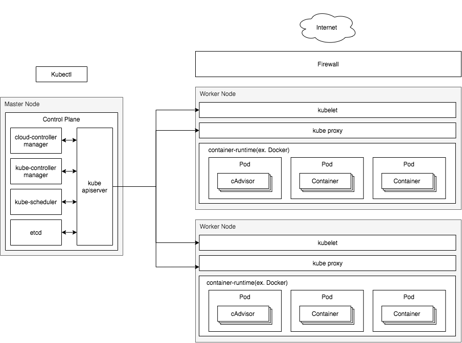

쿠버네티스는 컨테이너화 된 애플리케이션을 실행하기 위한 노드 머신

클러스터 내에 마스터 노드와 워크 노드가 있다.

마스터 노드는 애플리케이션을 실행하고, 클러스터를 원하는 상태로 유지 관리한다.

작업자 노드는 애플리케이션을 실제로 실행한다.

컨테이너는 개발 머신에 연결된 것 이 아니라 클러스터 전체에서 추상화 된다.

-----

용어

* 워크로드: 쿠버네티스에서 구동되는 애플리케이션

